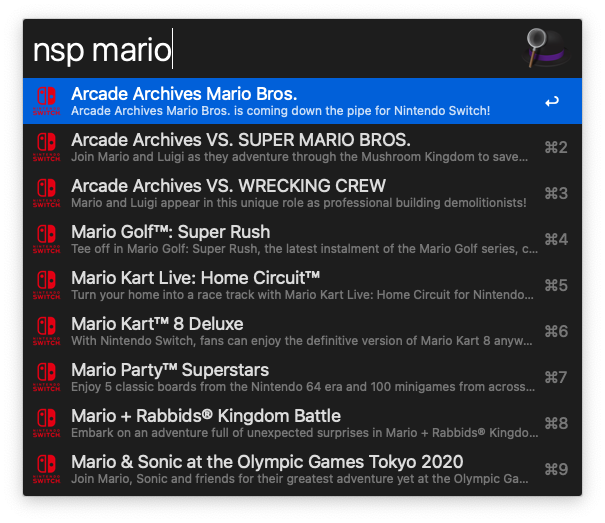
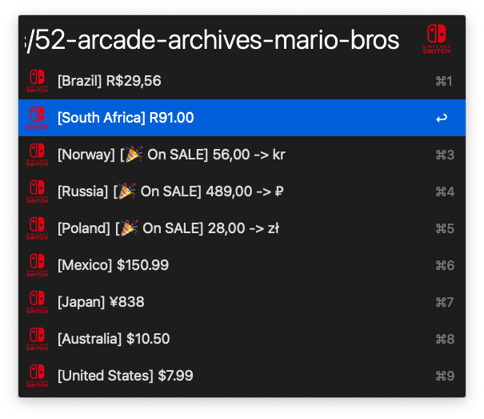

# alfred-nintendo-switch-price-compare

Compare Nintendo Switch game prices by country through https://eshop-prices.com/






## Install

```
$ npm install --global alfred-nintendo-switch-price-compare
```

## Config

You can change currency unit in below tab (Workflow Environment Variables)


## Icon source

https://toppng.com/download-file/2250

## Related

🔗 This workflow is converted from [arvis-nintendo-switch-price-compare](https://github.com/arvis-workflows/arvis-nintendo-switch-price-compare).
